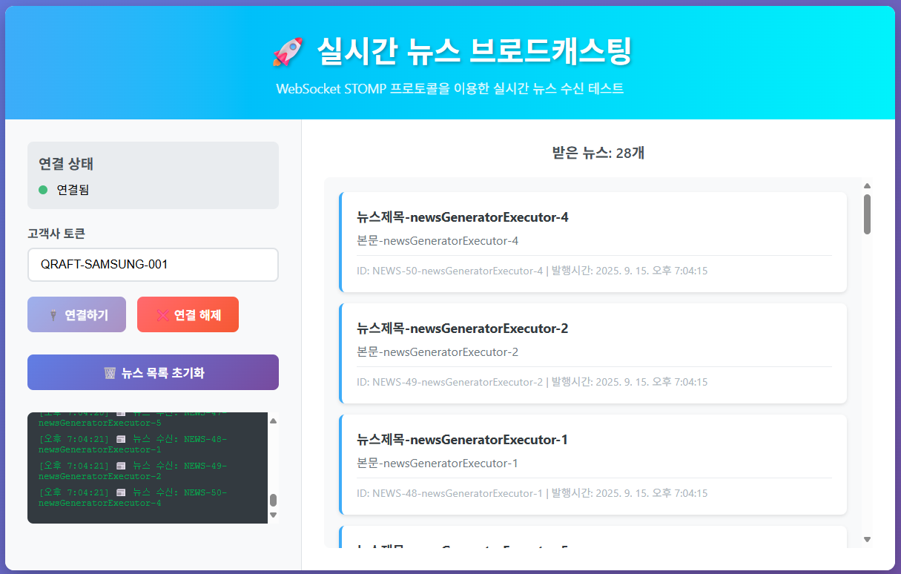
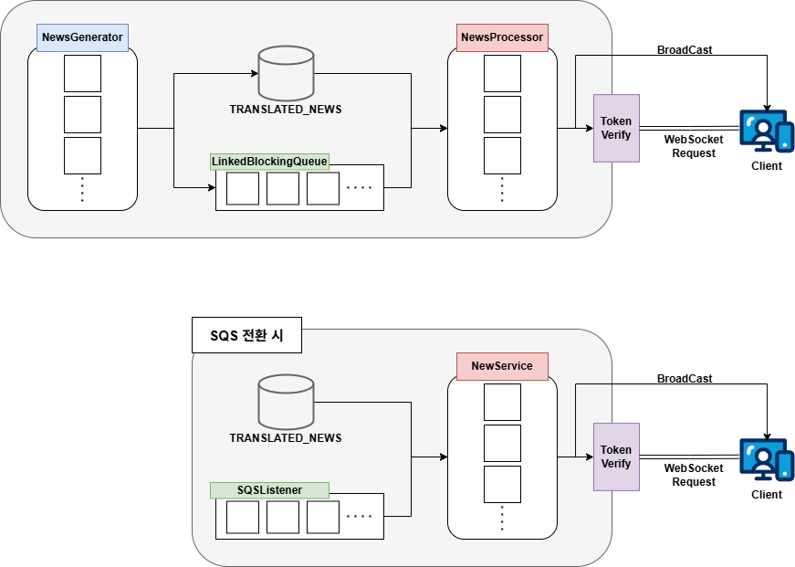

# QNewsTest

Qraft Technologies AI Product 채용과제 - 백엔드 개발자

## 프로젝트 개요

AI 번역된 뉴스를 고객사에게 실시간으로 전송하는 WebSocket 기반 브로드캐스팅 시스템입니다.

### 주요 기능
- WebSocket을 통한 실시간 뉴스 브로드캐스팅
- 토큰 기반 고객사 인증 및 중복 연결 방지
- 내부 큐를 통한 Producer-Consumer 패턴 시뮬레이션
- AWS SQS 전환을 위한 확장 가능한 아키텍처

## 기술 스택
- **언어**: Java 21
- **프레임워크**: Spring Boot 3.5.5
- **WebSocket**: STOMP over SockJS
- **ORM**: Spring Data JPA
- **데이터베이스**: H2 2.3.232 (인메모리)

## 실행 방법

### 1. 프로젝트 클론 및 빌드

```bash
 cd news
./gradlew clean build
./gradlew bootRun
```

### 2. 애플리케이션 실행 확인

```bash
# 서버 시작 로그 확인
INFO - 뉴스 생성용 스레드 풀 초기화: Core=5, Max=10, Queue=50
INFO - 뉴스 프로세서용 스레드 풀 초기화: Core=5, Max=10, Queue=30
INFO - 뉴스 생성 시작 :: 실제 AI 번역 시스템 시뮬레이션
INFO - 뉴스 프로세서 시작 :: SQS 대용 시뮬레이션
```

### 3. 웹 클라이언트 테스트

1. 브라우저에서 `test.html` 파일 열기
2. 고객사 토큰 입력:
    - `QRAFT-SAMSUNG-001` 
    - `QRAFT-LG-002` 
    - `QRAFT-HYUNDAI-003`
3. "연결하기" 버튼 클릭
4. 실시간 뉴스 수신 확인 (30초마다 뉴스 생성)

### 4. 데이터베이스 확인

H2 Console: http://localhost:8080/h2-console
- JDBC URL: `jdbc:h2:mem:testdb`
- Username: `sa`
- Password: (공백)

## 시스템 동작 플로우



### 현재 구현 (시뮬레이션)
1. **뉴스 생성**: `NewsGenerator`가 스레드로 뉴스 생성
2. **큐 저장**: 생성된 뉴스를 DB 저장 후 큐에 ID 추가
3. **뉴스 처리**: `NewsProcessor`가 스레드로 큐에서 ID 소비
4. **웹 소켓 연결**: 고객사의 고유한 토큰에 대한 검증 및 동시 접속 차단
5. **브로드캐스팅**: ID로 DB 조회 후 WebSocket으로 전송

## AWS SQS 전환 가이드

### 1. 의존성 추가

```
spring-cloud-aws-messaging 의존성 추가 
```

### 2. 설정 파일 수정

```yaml
# application.yml
cloud:
  aws:
    region:
      static: ap-northeast-2
    credentials:
      access-key: ${AWS_ACCESS_KEY}
      secret-key: ${AWS_SECRET_KEY}
    sqs:
      queue:
        news: news-broadcast-queue
```

### 3. 제거해야 할 컴포넌트

**완전히 삭제**:
- `NewsGenerator.java`
- `NewsGenerationService.java`
- `NewsProcessor.java`
- `NewsProcessorService.java`
- `AsyncConfig.java`

**NewsServiceImpl에서 제거**:
```java
// 제거할 부분
private final LinkedBlockingQueue<String> queue = new LinkedBlockingQueue<>();

public void addNews(NewsRequestDto newsRequestDto) { // 전체 메서드 삭제 }
public String getNewsId() { // 전체 메서드 삭제 }
```

### 4. SQS 리스너 활성화

```java
// NewsController.java
@SqsListener("${cloud.aws.sqs.queue.news}")
public void receiveFromSqs(@Payload String newsId) {
    log.info("SQS에서 뉴스 ID 수신: {}", newsId);
    newsService.broadCastNews(newsId);
}
```

## 핵심 기능 설명

### 1. WebSocket 연결 관리

**연결 과정**:
1. 클라이언트가 토큰과 함께 WebSocket 연결 요청
2. `HandshakeInterceptor`에서 토큰 검증 및 중복 연결 체크
3. 연결 성공 시 고객사 상태를 `active`로 변경
4. 연결 종료 시 자동으로 `inactive`로 변경

### 2. 토큰 기반 인증

- 각 고객사는 고유한 토큰 보유
- 하나의 토큰당 하나의 연결만 허용
- 중복 연결 시도 시 새로운 연결 차단

### 3. 예외 처리

- WebSocket 연결 실패
- DB 조회 실패
- 메시지 전송 실패
- 모든 예외에 대한 상세 로깅